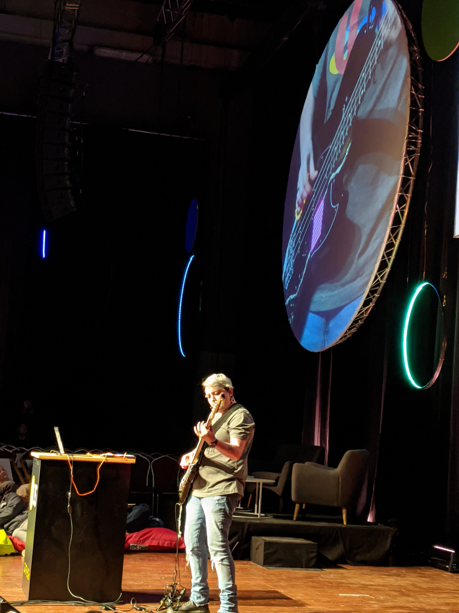

footer: @nodebotanist	

# Approaching DevRel as an educator

---

# whoami

* @nodebotanist
* Agender (they/their/them pronouns)
* IoT addict and author (Kassandra Perch)
* DevRel for 5 years

---

## There are lots of similarities between DevRel and teaching
### (There are also, of course, differences)

---

## The similarities with teaching in a formal setting

* The topic is set in advance
* Many ways to learn
* Questions, questions

---

# The topic is set in advance

* Users have a good idea what they are setting out to learn
* For each piece of content, you can set pre-reqs and level of knowledge

---

# Different ways to learn

* Requires us to create many different kinds of content
* You want to engage with as many learning styles as possible
* You want your content to have a cohesive style and message across mediums

---

# Questions abound

* Users will always have questions, and that's great!
* You want to know what those questions are...
* ...and respond to them as quickly as possible

---

## The differences with teaching in a formal setting

* It's much harder for users to engage you directly
* Your users will come from an extremely broad range of skill sets, time commitments, and levels
* Your users won't come in batches

---

# The difficulty with user engagement

* Users tend to engage with your content directly, and with you indirectly if at all.
* Your engagement with users tends to be asynchronous in nature
* Users don't always know how to communicate questions or feedback

---

# The spectrum of user skill and time

* You'll have users ranging from brand new to full knowledge
* You'll need to know how to get them where they're going without getting in their way
* Your content needs to be navigable

---

## How to use the similarities to your benefit

* Create content that engages different ways of learning
* Keep your documentation centered around your product, but also technologies related to your product
* Consider common pitfalls and questions and prepare to offer this information in advance

---

# Refresher: main types of learners

* Auditory
* Visual
* Kinesthetic

---

# Creating content that engages all

* Your usuals: written docs, tutorials, videos
* Streaming
* Webinars
* Games/At-your-own-pace workshops

---

# Moving into related technologies

* Pulls in users trying to learn about related tech towards your product
* Helps newer users keep up with your product without feeling lost
* Helps you keep a good eye on the changing tech around your product

---

# Predicting questions and pitfalls

* Make sure in your non-real-time content to include the answers to common questions
* Add these in in a way that won't block your power users, but will give new users a path to follow
* Make sure to keep these up to date and do the work to keep that content relevant

---

## How to navigate the differences

* Find as many ways as you can to allow your users to contact you in as direct a manner as possible
* Create experiences that allow power users to jump ahead without leaving new users behind
* Make that time to first hello world as short as possible to get users in the right place quickly

---

# Finding ways to engage your users

* Create open spaces for your users to contact you: GitHub (drop ICE), Slack, message boards
* See how users solve each other's problems, and let that advise your content
* Create power users in your community and enable them-- it's worth the extra time.

---

# Building a cohesive experience for your content

* Keep a cohesive goal in mind that each piece of content fits into
* Build paths; link your content together and help users find the path that suits them
* Curate and actively hone your paths and overall vision regularly to avoid a tangled jungle

---

# Building Content that invites users to learn

---

# Never leave your users hanging

* Always have another piece of content to consume, even if it's not yours
* Have real calls to action-- not just 'sign up for our newsletter'
* Make yourself available to users for feedback

---

# Give users projects to explore, tear apart, and modify

* Treat demos like legos-- make them modular, easy to dissect, easy to augment
* Build repositories of these demos that solve many common user problems
* Let users contribute to these repositories and build the next wave

---

# Example: The Cloudflare Workers Documentation

---

# A brief aside

---

# Thank you for listening!

* @nodebotantist
* kas@cloudflare.com
